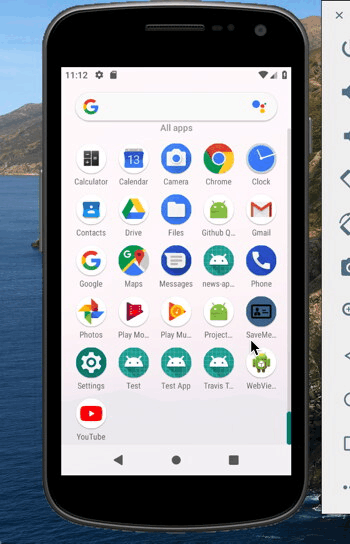

# SaveMe
Daniel Victoria
Nicolas Ojeda
Danny Tran
Sebastian Sunjoto

## Description
SaveMe is an application that aims to be an alternative to the contacts application that is on all modern phones. SaveMe differs from the regular contacts application by including a QR code generator and QR code scanner. 

## Background
The inclusion of these features was decided up when one of our members of our development team was complaining about how he kept losing friends he had made when he went to concerts. This was due to concerts usually being held in an area with poor moblie service. We wanted a way for them to exchange information without dealing with typing it on each others phones, being unable to hear each others information due the background noise of the concert, and avoid dealing with poor internet service.

## Features     
*  Store any contact information that the user sets up
*  The ability to obtain information from another user
*  The use of a QR code generator to create a code that another user can scan to get the users information
*  The use of a QR code scanner that allows the app to obtain information from other users QR codes

## Issues
For storing our contact information we were originally going to work with Firebase but we have opted out on that endevor due to the hurdle of integrating Firebase into SaveMe, instead we decided to use SQLite. In SaveMe we plan to have 3 tables; the first table deals with the User's own information stored on the application, the second table deals with all the information the user collects from other users, and the third table is used to store all previous information collected.  

## Why QR Code
The reason we decided on QR codes for passing along information instead of NFC or Bluetooth was due to the fact that QR codes only really need a camera to be scanned which are commonly availible on most android devices. For NFC, near field communication, the problem was you would need a phone that would be equiped with said technology which are not readily avalible on the lower end android devices, so in the interest of avability we went with QR codes over NFC. The problem with Bluetooth was that in a setting like a concert there would be many wireless devices which would interfere with the transfer of data between the users. 

## Libraries
For the QR code generator and QR code scanner we have decided to use ZXing, an open source multi-format 1D/2D barcode image processing library implemented in Java. Using ZXing, short for Zebra Crossing, we were able to code the fragments that handle the QR code generation and the QR code scanning. 

## Design
Some of the design was implemented with design toolkit software "Sketch" for Mac. Sketch is a design software for layouts , views and any graphic components of an application.

## Project Resources

- https://github.com/zxing/zxing/wiki/Getting-Started-Developing

- https://www.youtube.com/watch?v=NqFVqLqbw_g

- https://www.youtube.com/watch?v=fxl_Cr8gHl4

## Demo
 
 

